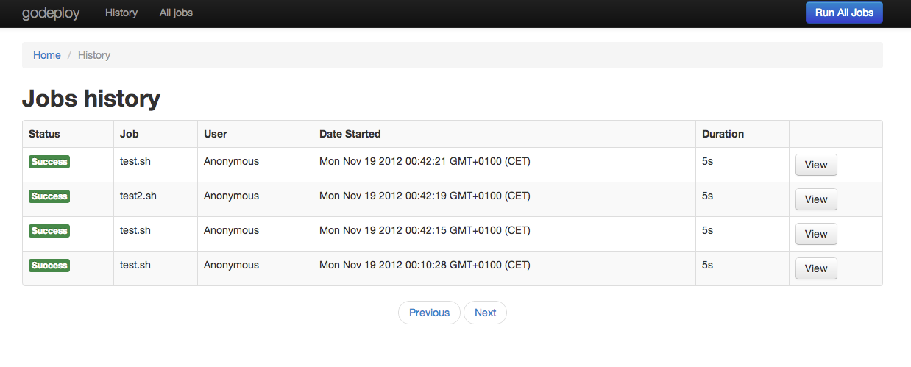

godeploy
--------

*godeploy* is a drop-in web interface for running/monitoring/logging deployment scripts

Just point to the your fabric scripts and logs directories and that's it.

Usage
-----

Imagine you have a fabric command:

	fab -Hprod1 django.deploy:branch=master

What you need to do now to use run the above fabric script using *godeploy* is to put it in a bash script:

	echo '#!/bin/bash
	fab -Hprod1 django.deploy:branch=master' > django_deploy.sh; chmod +x django_deploy.sh

	godeploy -d ./your_fabric_scripts -l /tmp/

Navigate to: http://localhost:8000/#listJobs and run your script using *godeploy*

Features
--------

- Run any bash script in a nice web interface.
- Realtime feedback (see the progress of your scripts as they execute)
- Logs - currently in a directory (no database needed)
- Search your logs (comming next)

Components
----------

- golang (goroutines to run processes + http server)
- Twitter Bootstrap
- Backbone.js

